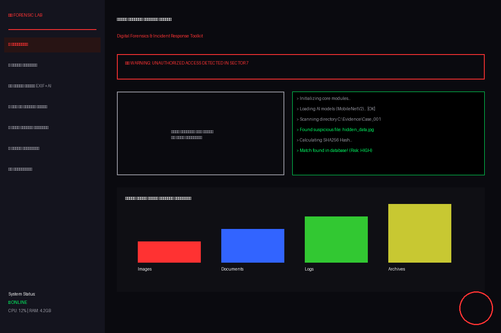

# دليل التشغيل السريع - أداة التحقيق الجنائي الرقمي

## 🖥️ التوافق مع ويندوز
نعم، الأداة **تعمل بالكامل على نظام ويندوز**! فقط اتبع الخطوات التالية:

### المتطلبات الأساسية:
1. تثبيت **Python 3.8** أو أحدث من [python.org](https://www.python.org/downloads/)
2. تأكد من إضافة Python إلى مسار النظام (PATH) أثناء التثبيت

### خطوات التثبيت على ويندوز:

```powershell
# 1. افتح PowerShell أو Command Prompt كمسؤول (Run as Administrator)

# 2. انتقل إلى مجلد الأداة
cd C:\Path\To\ForensicLab

# 3. قم بتثبيت المكتبات المطلوبة
pip install -r requirements.txt

# 4. شغل الأداة
streamlit run forensic_lab_interface.py
```

سيتم فتح المتصفح تلقائياً على العنوان: `http://localhost:8501`

---

## 🎨 صورة الواجهة

لقد قمت بتوليد صورة تجريبية للواجهة لتعطيك فكرة عن التصميم!



**وصف الواجهة:**
- **الخلفية:** سوداء داكنة جداً مع لمسات زرقاء خفيفة (Cyberpunk Style)
- **الألوان:** أحمر نيون للعناصر الهامة والتحذيرات، أخضر للطرفية (Terminal)
- **القائمة الجانبية:** تحتوي على جميع وحدات التحليل
- **المنطقة الرئيسية:** تعرض حالة النظام، منطقة رفع الملفات، ومخرجات الطرفية الحية
- **التأثيرات:** نصوص متوهجة، أزرار تفاعلية، ورسوم بيانية ديناميكية

---

## 🚀 المميزات الجديدة في الإصدار المطور

### 1. واجهة ويب تفاعلية (Streamlit)
- تصميم مرعب واحترافي يشبه أفلام الاختراق
- سهلة الاستخدام عبر السحب والإفلات
- تعمل على أي متصفح (Chrome, Firefox, Edge)

### 2. وحدات تحليل متقدمة
- **بصمات رقمية متعددة:** MD5, SHA1, SHA256, SHA512
- **تحليل صور بالذكاء الاصطناعي:** كشف المحتوى + بيانات EXIF + GPS
- **بحث عن بيانات حساسة:** بطاقات ائتمان، إيميلات، كلمات مرور
- **الخط الزمني:** إعادة بناء تسلسل الأحداث
- **استخراج ملفات محذوفة:** Carving للترويسات الملفية

### 3. تقارير احترافية
- تصدير بصيغة CSV للجداول
- تصدير بصيغة JSON للبيانات المهيكلة
- رسوم بيانية تفاعلية باستخدام Plotly

---

## 🛠️ حل المشاكل الشائعة على ويندوز

### المشكلة: خطأ في تثبيت TensorFlow
**الحل:**
```powershell
pip install tensorflow-cpu
```
(النسخة CPU أخف وتعمل بشكل أفضل على معظم أجهزة ويندوز)

### المشكلة: البورت 8501 مشغول
**الحل:**
```powershell
streamlit run forensic_lab_interface.py --server.port 8502
```

### المشكلة: لا تظهر الصور أو الخطوط بشكل صحيح
**الحل:** تأكد من تحديث مكتبة Pillow:
```powershell
pip install --upgrade pillow
```

---

## 📞 الدعم والمساعدة
إذا واجهت أي مشكلة، تحقق من ملف `requirements.txt` وتأكد من تثبيت جميع المكتبات.

**استمتع بالتجربة الاحترافية في التحقيق الجنائي الرقمي!** 🕵️‍♂️💻
